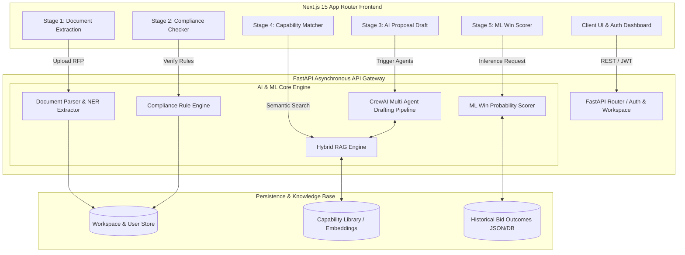
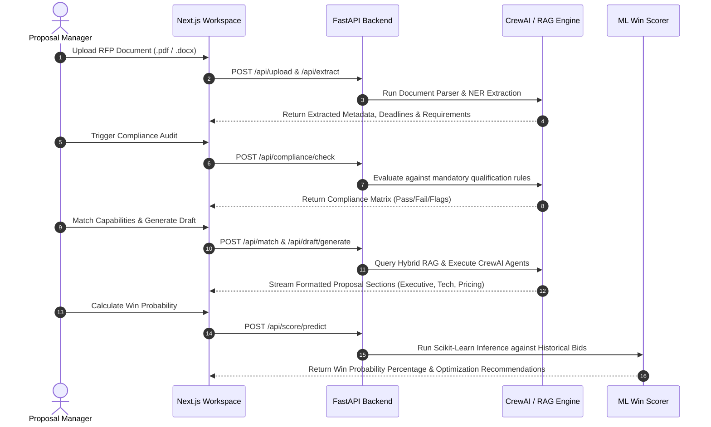

# 🚀 BidEngine: AI-Powered Autonomous Proposal & RFP Win Engine

<div align="center">


**An enterprise-grade, multi-agent AI platform designed to automate RFP analysis, verify compliance, match corporate capabilities via Hybrid RAG, draft winning proposals, and predict proposal success using machine learning.**

[Overview](#-overview) • [System Architecture](#-system-architecture) • [Key AI Modules](#-key-ai--ml-modules) • [Tech Stack](#-technology-stack) • [Getting Started](#-getting-started) • [Directory Structure](#-project-directory-structure)

---

</div>

## 🌟 Overview

**BidEngine** transforms how organizations respond to Requests for Proposals (RFPs) and tenders. Traditional proposal writing is slow, manual, and error-prone. BidEngine bridges the gap by leveraging autonomous **CrewAI multi-agent pipelines**, **Hybrid Retrieval-Augmented Generation (RAG)**, and **Machine Learning scoring models** to generate compliant, high-scoring proposals in minutes.

### 💡 Core Value Proposition
1. **Automated RFP Deconstruction**: Instantaneous Named Entity Recognition (NER) and metadata extraction from complex RFP documents.
2. **Zero-Blindspot Compliance**: Automated evaluation against strict RFP qualification criteria and legal mandates.
3. **Intelligent Capability Matching**: Vector-based search linking your corporate capability library to specific RFP requirements.
4. **Autonomous Multi-Agent Drafting**: CrewAI agents collaboratively write executive summaries, technical approaches, and pricing narratives.
5. **Data-Driven Win Prediction**: Built-in ML regression/classification scorer evaluating proposal strength against historical bid outcomes.

---

## 🏗 System Architecture

> [!NOTE]
> **📚 Deep-Dive Technical Documentation & Workflow Specifications**
> For exhaustive architectural specifications, data transformations, and sequence diagrams, please refer to our dedicated documentation suite:
> * **[🏗 Complete System Architecture & Topology Specification](docs/SYSTEM_ARCHITECTURE.md)** (Full-stack design, AI pipelines, Vector search, and Docker layout)
> * **[🔄 End-to-End Workflows & Sequence Diagrams](docs/COMPLETE_WORKFLOW.md)** (Detailed sequence diagrams across all 5 stages of the proposal lifecycle)

BidEngine is architected as a modern decoupled full-stack application. The **Next.js 15 App Router** frontend provides a highly responsive, real-time 5-stage workflow workspace, communicating over REST/JSON with a high-concurrency **FastAPI** Python backend powering the AI and ML inference pipelines.



---

## 🔄 The 5-Stage Proposal Generation Workflow



---

## 🧠 Key AI & ML Modules

### 1. 🔍 Document Parser & NER Extractor (`backend/services/ner_extractor.py`)
* Automatically ingests multi-page RFP documents and extracts critical structured data.
* Identifies submission deadlines, budgetary ceilings, mandatory compliance clauses, evaluation weights, and technical scopes using Named Entity Recognition and natural language processing.

### 2. 🛡️ RFP Compliance Engine (`backend/services/compliance_engine.py`)
* Evaluates RFP clauses against corporate qualifications and legal boundaries.
* Generates an automated compliance risk assessment matrix, flagging potential disqualifiers before engineering resources are committed.

### 3. 🕸️ Hybrid RAG & Capability Matcher (`backend/services/hybrid_rag_engine.py`)
* Combines dense vector similarity search with sparse keyword retrieval to query your corporate **Capability Library** (`backend/data/capability_library.json`).
* Retrieves past project references, case studies, and team resumes that precisely match the RFP's scope of work.

### 4. 🤖 CrewAI Multi-Agent Drafting Pipeline (`backend/services/crewai_pipeline.py`)
* Orchestrates specialized AI agents working collaboratively:
  * **Lead Solution Architect Agent**: Constructs the technical approach and architecture design.
  * **Proposal Writer Agent**: Synthesizes RAG context into persuasive executive summaries and narratives.
  * **Compliance Auditor Agent**: Reviews draft outputs to ensure alignment with mandatory requirements.

### 5. 📈 Machine Learning Win Scorer (`backend/services/ml_win_scorer.py`)
* Loads a pre-trained regression/classification model (`backend/ml_models/win_scorer.pkl`).
* Analyzes proposal variables—such as capability match score, compliance coverage, pricing competitiveness, and historical win/loss data (`backend/data/bid_history.json`)—to calculate an accurate win probability score.

---

## 🛠 Technology Stack

| Layer | Technologies & Libraries |
| :--- | :--- |
| **Frontend Framework** | Next.js 15 (App Router), React 19, TypeScript |
| **Styling & UI** | Vanilla CSS Design System, Modern Glassmorphism & Animations, Lucide Icons |
| **Backend API Gateway** | Python 3.11, FastAPI, Pydantic v2, Uvicorn, Python-Jose (JWT Auth) |
| **AI & LLM Orchestration** | CrewAI, LangChain, OpenAI / Custom LLM APIs, Hybrid RAG |
| **Machine Learning** | Scikit-Learn, NumPy, Pandas, Joblib (Model Serialization) |
| **Data & Persistence** | MongoDB / Async JSON Store, Vector Embeddings |
| **DevOps & Containerization** | Docker, Docker Compose, Multi-stage builds |

---

## 🚀 Getting Started

You can run the BidEngine stack either using **Docker Compose** (recommended for instant deployment) or via local manual setup.

### Option A: One-Click Launch with Docker Compose 🐳

Ensure you have Docker and Docker Compose installed on your system.

```bash
# 1. Clone the repository
git clone https://github.com/balaj-mir/BidEngine.git
cd BidEngine

# 2. Configure environment variables
cp .env.example .env

# 3. Build and launch the full stack (Frontend + Backend)
docker-compose up --build
```

* **Frontend Application**: [http://localhost:3000](http://localhost:3000)
* **Backend API Documentation (Swagger/OpenAPI)**: [http://localhost:8000/docs](http://localhost:8000/docs)

---

### Option B: Local Manual Development Setup 💻

#### 1. Backend Setup (FastAPI + AI Engine)
```bash
# Navigate to backend directory
cd backend

# Create and activate virtual environment
python -m venv venv
# On Windows:
venv\Scripts\activate
# On macOS/Linux:
# source venv/bin/activate

# Install Python dependencies
pip install -r requirements.txt

# Start the FastAPI development server
uvicorn main:app --host 0.0000 --port 8000 --reload
```

#### 2. Frontend Setup (Next.js 15)
```bash
# Open a new terminal and navigate to frontend directory
cd frontend

# Install Node.js dependencies
npm install

# Start the Next.js development server
npm run dev
```

---

## 📁 Project Directory Structure

```text
d:\bid-engine\
├── 🐳 docker-compose.yml       # Full-stack container deployment configuration
├── ⚙️ .env.example             # Template for environment variables and API keys
├── 🚫 .gitignore               # Security and build exclusion rules
├── 📖 README.md                # Project documentation & system architecture
│
├── 📂 backend/                 # FastAPI Asynchronous Python Backend
│   ├── 🚀 main.py              # API application entry point & CORS configuration
│   ├── 📦 requirements.txt     # Python dependencies (FastAPI, CrewAI, Scikit-Learn)
│   ├── 🐳 Dockerfile           # Backend container build instructions
│   │
│   ├── 📂 routers/             # REST API endpoints
│   │   ├── auth.py             # User authentication & JWT token endpoints
│   │   ├── workspace.py        # Proposal workspace lifecycle management
│   │   ├── upload.py           # RFP file ingestion & handling
│   │   ├── compliance.py       # RFP compliance evaluation routes
│   │   ├── draft.py            # AI proposal drafting endpoints
│   │   ├── match.py            # Capability matching routes
│   │   ├── score.py            # Win probability prediction endpoints
│   │   └── export.py           # Proposal document export (PDF/DOCX)
│   │
│   ├── 📂 services/            # Core AI, ML, and Business Logic
│   │   ├── ner_extractor.py    # Named Entity Recognition & RFP parsing
│   │   ├── compliance_engine.py# Automated compliance matrix generation
│   │   ├── hybrid_rag_engine.py# Retrieval-Augmented Generation service
│   │   ├── crewai_pipeline.py  # Multi-agent autonomous drafting workflow
│   │   ├── ml_win_scorer.py    # Scikit-learn win probability inference
│   │   ├── document_parser.py  # Multi-format document ingestion utilities
│   │   ├── export_service.py   # Document generation engine
│   │   └── privacy_service.py  # Data anonymization & privacy safeguards
│   │
│   ├── 📂 models/              # Pydantic & Database schemas
│   ├── 📂 ml_models/           # Pre-trained ML model weights (win_scorer.pkl)
│   ├── 📂 data/                # Sample RFP datasets & Capability Library JSON
│   └── 📂 tests/               # Unit & integration test suite
│
└── 📂 frontend/                # Next.js 15 TypeScript Web Application
    ├── 📦 package.json         # Node.js dependencies & scripts
    ├── 🐳 Dockerfile           # Frontend container build instructions
    │
    └── 📂 src/app/             # Next.js App Router UI Pages
        ├── 🔐 (auth)/          # Authentication pages (/login, /register)
        ├── 📊 dashboard/       # Proposal management dashboard
        ├── 📚 capability-library/ # Corporate capability management UI
        ├── 📈 analytics/       # Bid performance & win rate analytics
        │
        └── 📂 workspace/[id]/  # 5-Stage Active Workspace Pipeline
            ├── 📄 page.tsx     # Workspace overview & status dashboard
            ├── 📂 extract/     # Stage 1: Document extraction & NER analysis UI
            ├── 📂 compliance/  # Stage 2: Compliance checking matrix UI
            ├── 📂 draft/       # Stage 3: Multi-agent AI drafting interface
            ├── 📂 match/       # Stage 4: Capability RAG matching UI
            └── 📂 score/       # Stage 5: ML win probability prediction UI
```

---

## 🧪 Testing & Verification

The backend includes an automated pytest test suite covering extraction accuracy, ML scoring inference, RAG retrieval, and privacy safeguards.

```bash
cd backend
pytest tests/ -v
```

---

## 📄 License & Ownership

Developed for automated RFP evaluation and proposal generation. All rights reserved.
