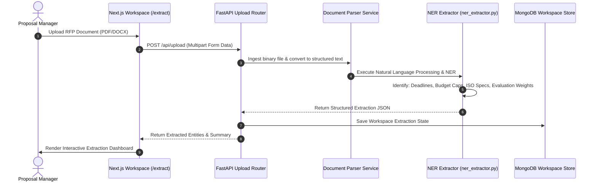
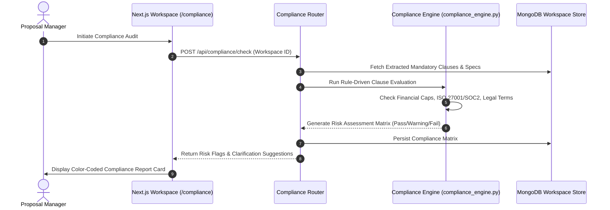
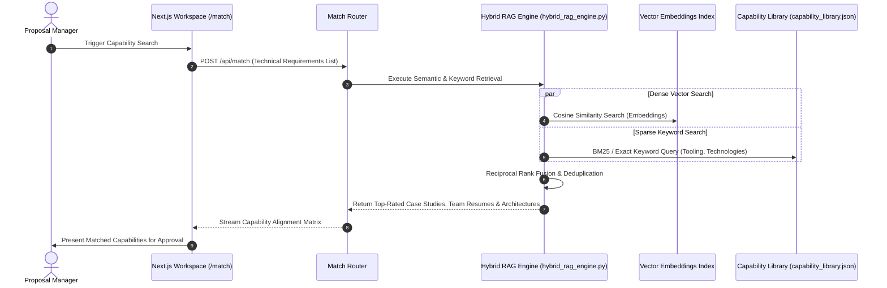
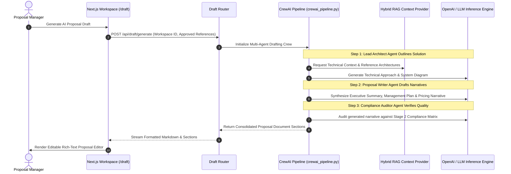
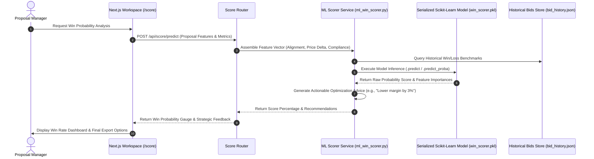

# 🔄 BidEngine Complete System Workflows & Lifecycle Specification

This document details the end-to-end operational workflows, data transformations, and inter-process communication sequences across the 5 distinct lifecycle stages of the **BidEngine** proposal automation platform.

---

## 1. End-to-End Proposal Lifecycle Workflow

```mermaid
stateDiagram-v2
    [*] --> Upload: Ingest RFP (.pdf/.docx)
    Upload --> Extraction: Stage 1 - Parse & NER Analysis
    
    state Extraction {
        [*] --> TextParsing: Extract Raw Text & Tables
        TextParsing --> EntityRecognition: NER Engine (Deadlines, Budget, Specs)
        EntityRecognition --> MetadataJSON: Store in Workspace DB
    }
    
    Extraction --> Compliance: Stage 2 - Compliance Audit
    
    state Compliance {
        [*] --> LoadRules: Ingest Mandatory Clauses
        LoadRules --> EvaluateRisk: Cross-reference Corporate Guidelines
        EvaluateRisk --> RiskMatrix: Generate Pass/Warning/Fail Report
    }
    
    Compliance --> CapabilityMatch: Stage 3 - Capability Alignment
    
    state CapabilityMatch {
        [*] --> EmbedRequirements: Generate Vector Embeddings
        EmbedRequirements --> VectorSearch: Query Capability Library
        VectorSearch --> ReferenceRank: Rank Top Case Studies & Tooling
    }
    
    CapabilityMatch --> AIDrafting: Stage 4 - Multi-Agent Proposal Generation
    
    state AIDrafting {
        [*] --> ArchitectAgent: Solution & Architecture Outlining
        ArchitectAgent --> WriterAgent: RAG-Informed Narrative Drafting
        WriterAgent --> AuditorAgent: Compliance & Page Limit Verification
    }
    
    AIDrafting --> WinScoring: Stage 5 - ML Win Probability Prediction
    
    state WinScoring {
        [*] --> AggregateFeatures: Combine Match, Price & Compliance Metrics
        AggregateFeatures --> ScikitInference: Run Regression Model (win_scorer.pkl)
        ScikitInference --> RecommendationEngine: Output Probability & Optimization Advice
    }
    
    WinScoring --> Export: Export Final Proposal (.docx/.pdf)
    Export --> [*]
```



---

## 2. Stage-by-Stage Detailed Workflows & Sequence Diagrams

### Stage 1: RFP Ingestion & NER Extraction Workflow
When a proposal manager initiates a new workspace, the raw tender document must be converted into actionable machine-readable data.



---

### Stage 2: RFP Compliance Audit Workflow
Before investing engineering hours, BidEngine verifies that the organization meets mandatory RFP criteria.



---

### Stage 3: Hybrid RAG & Capability Matching Workflow
To generate realistic proposals, BidEngine aligns specific RFP requirements with verified corporate past performance.



---

### Stage 4: CrewAI Autonomous Proposal Drafting Workflow
The proposal drafting pipeline utilizes a collaborative multi-agent architecture where agents challenge and refine each other's output.



---

### Stage 5: Machine Learning Win Prediction Workflow
Before final submission, BidEngine evaluates proposal competitiveness using statistical regression.



---

## 3. Data Transformation & State Evolution

As a proposal moves through the BidEngine workspace pipeline, the underlying data structure evolves from raw unstructured documents to a fully scored, structured proposal artifact.

```text
[Raw RFP Upload: .pdf / .docx]
        |
        v  (NER Extractor)
[Structured Extraction State: { deadlines: [...], budget: "...", clauses: [...] }]
        |
        v  (Compliance Engine)
[Compliance Risk Matrix: { pass: 14, warnings: 2, fails: 0, matrix: [...] }]
        |
        v  (Hybrid RAG Engine)
[Matched References Context: { case_studies: [...], resumes: [...], tech_stack: [...] }]
        |
        v  (CrewAI Multi-Agent Pipeline)
[Draft Proposal Document: { executive_summary: "...", technical_approach: "...", pricing: "..." }]
        |
        v  (ML Win Scorer)
[Final Workspace Artifact: { win_probability: 84.5%, recommendations: [...], export_ready: true }]
```
