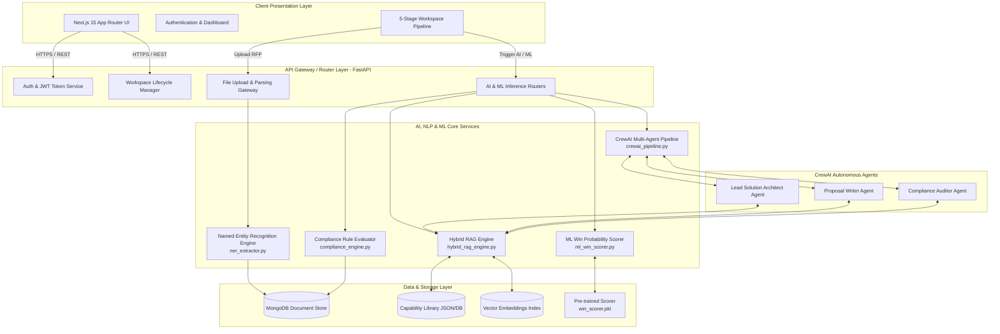

# 🏗 BidEngine System Architecture & Design Specification

This document provides an exhaustive technical overview of the **BidEngine** full-stack system architecture, data pipelines, AI/ML inference layers, and deployment topology.

---

## 1. High-Level System Topology

BidEngine is architected as a modern, decoupled full-stack application. The frontend is built using **Next.js 15 (App Router)** in TypeScript, while the asynchronous backend API gateway is powered by **Python 3.11** and **FastAPI**.

### ASCII System Architecture Overview

```text
+-----------------------------------------------------------------------------------+
|                           CLIENT LAYER (Web Browser)                              |
|   Next.js 15 (React 19, TypeScript, Tailored CSS / Glassmorphism UI)              |
+-----------------------------------------------------------------------------------+
                                         |
                                         | REST / JSON / JWT Authentication
                                         v
+-----------------------------------------------------------------------------------+
|                      API GATEWAY LAYER (FastAPI / Uvicorn)                        |
|   +-------------------+  +--------------------+  +----------------------------+   |
|   | Auth & Workspace  |  | File Upload Router |  | Proposal & Export Routers  |   |
|   +-------------------+  +--------------------+  +----------------------------+   |
+-----------------------------------------------------------------------------------+
                                         |
            +----------------------------+----------------------------+
            |                            |                            |
            v                            v                            v
+-----------------------+    +-----------------------+    +-------------------------+
|    AI CORE ENGINE     |    |   HYBRID RAG ENGINE   |    |    ML SCORING ENGINE    |
|                       |    |                       |    |                         |
| * Document Parser     |    | * Vector Search       |    | * Scikit-Learn Model    |
| * NER Extractor       |    | * Keyword Search      |    | * Regression Inference  |
| * Compliance Engine   |    | * CrewAI Multi-Agent  |    | * <win_scorer.pkl>      |
+-----------------------+    +-----------------------+    +-------------------------+
            |                            |                            |
            +----------------------------+----------------------------+
                                         |
                                         v
+-----------------------------------------------------------------------------------+
|                        PERSISTENCE & VECTOR STORE LAYER                           |
|   +--------------------+  +--------------------+  +---------------------------+   |
|   | MongoDB / Document |  | Vector Embeddings  |  | Capability Library JSON   |   |
|   +--------------------+  +--------------------+  +---------------------------+   |
+-----------------------------------------------------------------------------------+
```

---

## 2. Comprehensive Mermaid Architecture Diagram



---

## 3. Core Subsystems & Components

### 3.1 Document Ingestion & NER Pipeline
When an RFP is uploaded (PDF or DOCX), the `document_parser.py` service extracts text content while preserving structural headings and tables. The text is passed into `ner_extractor.py`, which applies rule-based NLP and entity recognition to isolate:
* **Submission Deadlines & Key Milestones**
* **Budgetary Constraints & Currency Caps**
* **Mandatory Evaluation Clauses & Weights**
* **Required Technical Certifications**

### 3.2 Automated RFP Compliance Engine
The compliance engine (`compliance_engine.py`) ingests the extracted clauses and cross-references them against corporate qualification constraints and legal guidelines. It categorizes requirements into a structured matrix:
* **Pass (Green)**: Full compliance achieved.
* **Warning (Yellow)**: Clarification required during pre-bid Q&A.
* **Fail/Flag (Red)**: Potential showstopper requiring executive review.

### 3.3 Hybrid RAG & Vector Retrieval Engine
To ensure generated proposals reflect actual company capabilities, the `hybrid_rag_engine.py` merges two retrieval strategies:
1. **Dense Vector Search**: Semantic matching using embeddings to locate relevant project case studies and technical architectures.
2. **Sparse Keyword Search**: Exact term matching for specific software tooling, ISO standards, and proprietary methodologies.

### 3.4 CrewAI Multi-Agent Drafting Orchestration
Unlike single-prompt LLM generators, BidEngine uses **CrewAI** to orchestrate specialized autonomous agents:
* **The Architect Agent**: Analyzes RFP requirements and outlines the technical solution, cloud architecture, and security posture.
* **The Writer Agent**: Synthesizes RAG retrieved references into compelling executive summaries and detailed narratives.
* **The Auditor Agent**: Inspects generated content to verify strict adherence to RFP instructions and page limits.

### 3.5 Machine Learning Win Probability Predictor
The win scoring engine (`ml_win_scorer.py`) loads serialized model weights (`win_scorer.pkl`). It takes a multivariate vector consisting of:
* Capability alignment score ($S_{cap}$)
* Compliance coverage ratio ($C_{ratio}$)
* Pricing deviation from historical winning averages ($\Delta P$)
* Historical win rates for similar project scopes

$$\text{Win Probability} = f(S_{cap}, C_{ratio}, \Delta P, \text{History})$$

---

## 4. Docker Containerization & DevOps Layout

BidEngine is packaged for seamless cloud or on-premise execution using Docker Compose.

```mermaid
graph LR
    subgraph Host [Docker Compose Host Environment]
        subgraph FE_Container [Container: frontend (Port 3000)]
            FE_APP[Next.js Node Server]
        end

        subgraph BE_Container [Container: backend (Port 8000)]
            BE_APP[FastAPI Uvicorn Workers]
            AI_LIB[CrewAI / Scikit-Learn Runtime]
        end
    end

    FE_APP <-->|Internal Docker Network (HTTP)| BE_APP
    Client[External Web Browser] -->|localhost:3000| FE_APP
    Client -->|localhost:8000/docs| BE_APP
```
